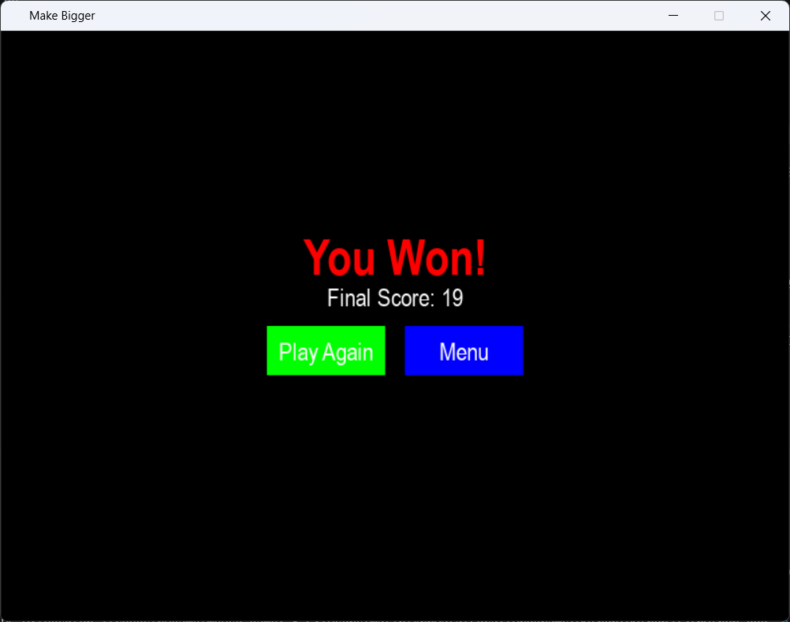

# 📈 Make Bigger (Python & Pygame)

A fast-paced arcade game built with **Python** and **Pygame** where you control a green square using your mouse. Collect food to grow larger, survive as your size continuously shrinks, stay inside the game area, and hold the maximum size long enough to win.


## Gameplay

Control the green square with your mouse and collect the blue food before you become too small.

- 📉 Your size gradually decreases over time.
- 🍎 Eating food increases your size and your score.
- 🚫 You cannot leave the play area.
- 🏆 Reach the maximum size and hold it for **3 seconds** to win.
- 💀 If your size reaches the minimum value, the game is over.
- ⏸️ Press **ESC** at any time to pause or resume the game.


## Features

- 🖱️ Mouse-controlled gameplay
- 🍎 Randomly spawning food
- 📈 Live score counter
- 📏 Dynamic player size
  - Grow by collecting food
  - Gradually shrink over time
- 🚫 Play area boundaries
- ⏳ On-screen victory countdown timer
- 🏆 Victory condition
  - Reach the maximum size
  - Hold it for 3 seconds to win
- 💀 Game Over screen
- ⏸️ Pause menu
- ▶️ Resume game
- 🔄 Play Again option
- 🏠 Return to Main Menu


## Technologies Used

- Python 3
- Pygame


## Project Structure

```text
Make-Bigger/
│
├── make_bigger.py
├── screenshots/
│   ├── menu.png
│   ├── gameplay.png
│   ├── pausemenu.png
│   ├── gameover.png
│   └── victory.png
├── LICENSE
├── requirements.txt
└── README.md
```


## Installation

Clone the repository:

```bash
git clone https://github.com/Matin-python/Make-Bigger.git
```

Move into the project folder:

```bash
cd Make-Bigger
```

Install the required package:

```bash
pip install pygame
```

or

```bash
pip install -r requirements.txt
```


## How to Run

```bash
python make_bigger.py
```


## How to Play

1. Move your mouse to control the green square.
2. Collect the blue food to grow larger and earn points.
3. Your size continuously decreases over time.
4. Stay inside the red game boundaries.
5. If your size reaches the minimum value, the game ends.
6. Reach the maximum size and hold it for **3 seconds** to win.
7. Press **ESC** to pause or resume the game.


## Controls

| Action | Input |
|---------|-------|
| Move Player | Mouse |
| Pause / Resume | ESC |
| Menu Navigation | Mouse |


## Game States

- 🏠 Main Menu
- ▶️ Playing
- ⏸️ Paused
- 🏆 Victory
- 💀 Game Over


## Screenshots

### Main Menu


### Gameplay


### Pause Menu


### Game Over


### Victory Screen




## Building an Executable (.exe)

You can package the game into a standalone Windows executable using **PyInstaller**.

Install PyInstaller:

```bash
pip install pyinstaller
```

Create the executable:

```bash
pyinstaller --onefile --windowed make_bigger.py
```

The executable will be created inside the `dist` folder.


## Future Improvements

- 🎨 Custom player sprite
- 🍎 Animated food
- 🔊 Sound effects and background music
- ⭐ High score saving
- ⚡ Multiple difficulty levels
- 🧱 Random obstacles
- ✨ Particle effects
- 🎯 Achievement system
- 🖥️ Fullscreen mode
- 🎮 Controller support
- 💾 Save game statistics
- 🌟 Visual countdown effects during the victory timer
- 🎵 Background music and menu animations


## Contributing

Contributions, suggestions, and bug reports are welcome. Feel free to fork the repository and submit a pull request.


## License

This project is licensed under the MIT License.


## Author

**Mohammad Reza Bakhshandeh**

Electrical Engineering (Electronics) Graduate

Interested in Python Development, Game Development, Computer Vision, Machine Learning, Deep Learning, and Artificial Intelligence.
