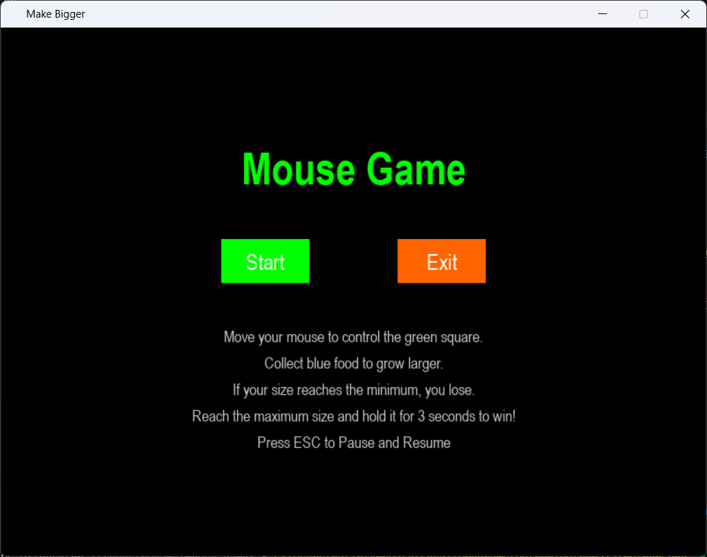
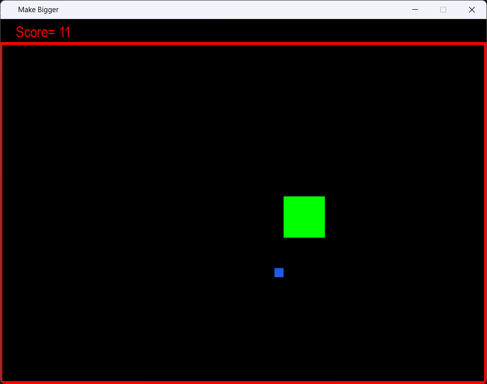
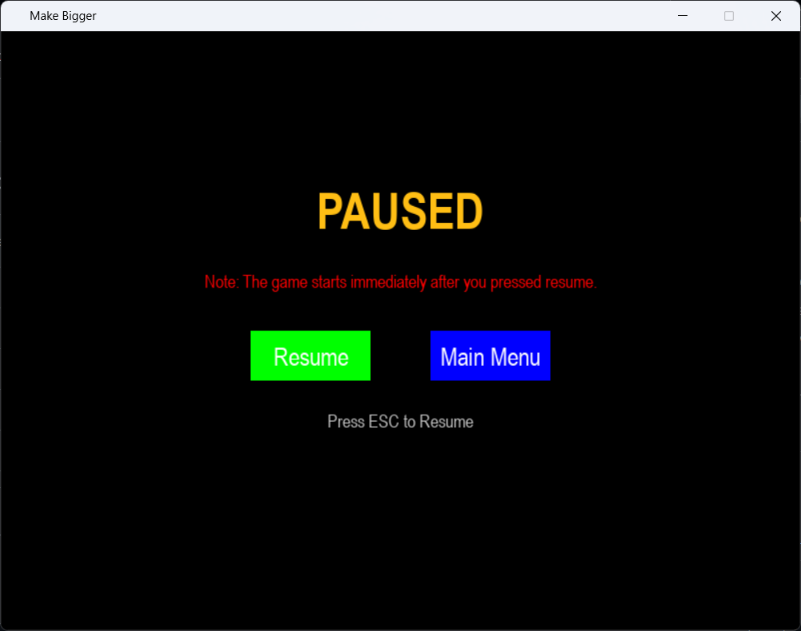

# 🖱️ Mouse Game (Python & Pygame)

A simple arcade game built with **Python** and **Pygame** where the player controls a shrinking square using the mouse. Collect food before your size reaches the minimum limit to survive and achieve the highest score possible.


## Gameplay

The player follows the mouse cursor around the screen.

- Your square gradually shrinks over time.
- Collect food to increase your size and earn points.
- If your size becomes too small, the game ends.
- Pause the game at any time using the **ESC** key.


## Features

- 🖱️ Mouse-controlled gameplay
- 🍎 Random food spawning
- 📈 Live score counter
- ⏸️ Pause menu
- ▶️ Resume game
- 🔄 Play Again option
- 🏠 Return to Main Menu
- 💀 Game Over screen
- 🎨 Simple and clean user interface
- 🧩 Object-Oriented Programming (OOP) design


## Technologies Used

- Python 3
- Pygame


## Project Structure

```
Mouse-Game/
│
├── mouse game.py
├── screenshots/
│   ├── menu.png
│   ├── gameplay.png
│   ├── pausemenu.png
│   └── gameover.png
├── LICENSE
├── requirements.txt
└── README.md
```


## Installation

Clone the repository:

```bash
git clone https://github.com/Matin-python/Mouse-Game.git
```

Move into the project folder:

```bash
cd Mouse-Game
```

Install the required package:

```bash
pip install pygame
```

or

```bash
pip install -r requirements.txt
```


## How to Run

```bash
python mouse game.py
```


## 🎮 Controls

| Action | Key |
|---------|-----|
| Move Player | Mouse |
| Pause / Resume | ESC |
| Menu Navigation | Mouse |


## 📷 Screenshots

### Main Menu



### Gameplay



### Pause Menu



### Game Over


## Game Rules

1. Move the green square using your mouse.
2. Collect the blue food squares.
3. Every food collected:
   - Increases your size.
   - Increases your score.
4. Your size continuously decreases over time.
5. The game ends when your size reaches the minimum limit.


## Future Improvements

- 🎵 Sound effects and background music
- 🏆 High score saving
- ⚡ Multiple difficulty levels
- 🍎 Different food types with special abilities
- 💥 Obstacles and hazards
- ✨ Animations and particle effects
- 🖼️ Custom sprites
- 🌐 Fullscreen support
- ⚙️ Settings menu
- 🎮 Controller support


## Create an Executable (.exe)

Install PyInstaller:

```bash
pip install pyinstaller
```

Create a single executable:

```bash
pyinstaller --onefile main.py
```

Or create a windowed executable (without a console window):

```bash
pyinstaller --onefile --windowed main.py
```

The executable will be generated inside the `dist` folder.


## Contributing

Contributions, suggestions, and bug reports are welcome. Feel free to fork the repository and submit a pull request.


## License

This project is licensed under the MIT License.


## Author

**Mohammad Reza Bakhshandeh**

Electrical Engineering (Electronics) Graduate

Interested in Python Development, Computer Vision, Machine Learning, and Artificial Intelligence.
